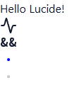

# Oxpecker.Solid.Lucide

Bindings for Lucide and Lucide-Lab icon packs.

Auto generated. In Oxpecker.Solid style.

## Usage

```fs
open Oxpecker.Solid.Lucide

[<SolidComponent>]
let App() =
    div() {
        h1() { "Hello Lucide!" }
        Lucide.Activity()
        Lucide.Ampersands(strokeWidth = 2)
        Lucide.Dot(color = "blue")
        Lucide.Dot(color = "rgb(200,200,200)")
    }
```
